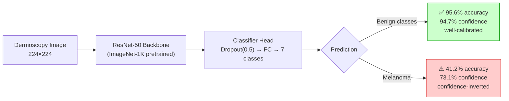
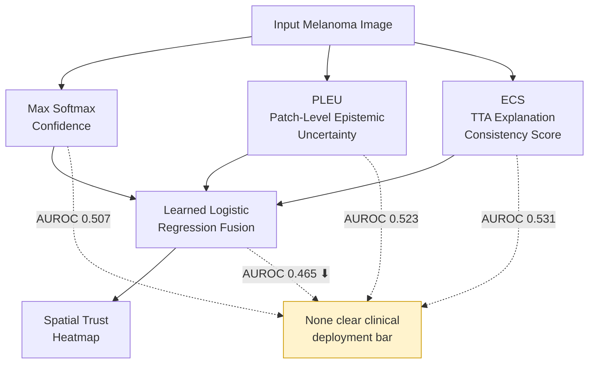
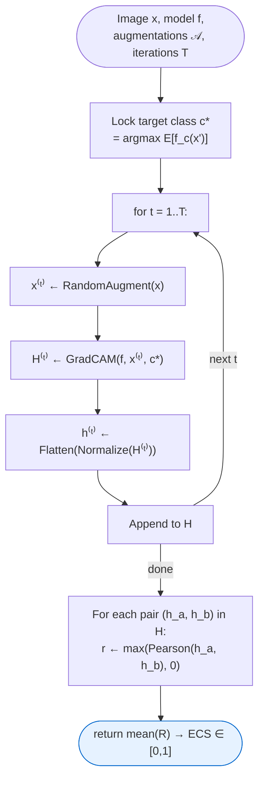
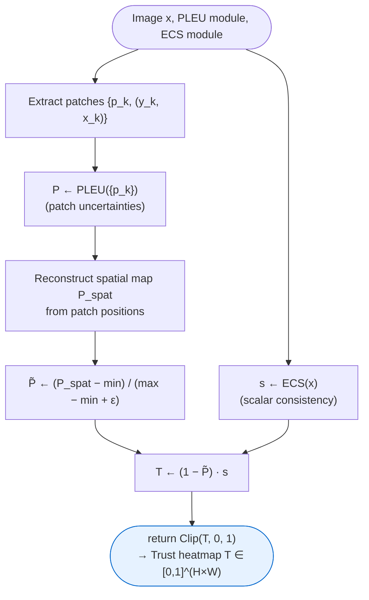
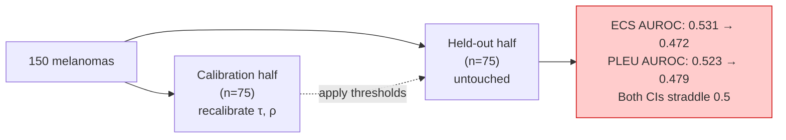

# TrustworthyMed

**Diagnosing the Limits of Confidence and Explanation-Based Trust Signals for Melanoma-Safe Classification**

Iqra Safdar · Malaika Arif · Yawar Abbas
Department of Computer Science, COMSATS University Islamabad, Sahiwal Campus, Pakistan

> This is a **diagnostic study**, not a proposed solution. We systematically test whether standard trust signals (confidence, patch-level uncertainty, explanation consistency, and their fusion) can actually flag melanoma misclassifications — and report honestly where they succeed, where they fail, and where they collapse to chance under proper held-out evaluation.

---

## TL;DR

A ResNet-50 hits **88.15%** aggregate accuracy on external hospital data but only **41.2%** on melanoma — the deadliest class — while being **73% confident** on its melanoma mistakes. We tested every standard fix (confidence rejection, cost-sensitive rejection, explanation consistency, patch-level uncertainty, learned fusion) and none of them reliably solve this at current sample sizes. A split-half validation shows the two most promising signals **collapse to chance-level** under honest held-out testing. We think that finding is more useful to the field than a framework that quietly overstates itself.

---

## 1. The Core Problem



**Confidence inversion, in one sentence:** the model is *most dangerous exactly where it should be most cautious* — it is nearly as confident on the melanomas it gets wrong as on the ones it gets right.

| Metric | Value |
|---|---|
| Aggregate accuracy (Vienna external, N=439) | 88.15% |
| Melanoma sensitivity | **41.2%** [95% CI: 28–56%] |
| Benign nevus accuracy | 95.6% |
| Mean confidence on misclassified melanomas | 73.1% |
| Cost-sensitive rejection (10× melanoma penalty) → retained accuracy | 25.8% |

---

## 2. What We Tested



### 2.1 Patch-Level Epistemic Uncertainty (PLEU)

Slides a window across the image, runs `K=10` stochastic MC-Dropout forward passes per patch, and flags patches where predictions disagree:

$$u_k = \frac{1}{K}\sum_{i=1}^{K}\left\lVert \sigma(z_k^{(i)}) - \bar\sigma_k \right\rVert^2 \qquad\qquad \mathrm{PLEU}(x) = \frac{1}{N_p}\sum_{k=1}^{N_p} \mathbb{1}[u_k > \tau_u]$$

`τ_u = 0.025`, empirically calibrated from the observed validation distribution (max 0.125, mean 0.017) — the naive default (0.3) sat above the observed maximum and produced degenerate all-zero scores.

### 2.2 Explanation Consistency Score (ECS) — novel to this work

MC-Dropout doesn't work here (the backbone has no dropout layers, so train-mode passes are identical). Instead: generate `T=10` augmented views, take Grad-CAM heatmaps under a **locked target class**, and measure how consistent the attention pattern stays under perturbation.

$$c^{*} = \arg\max_c \; \mathbb{E}_{x' \sim \mathcal{A}(x)}\big[f_c(x')\big] \qquad\qquad \mathrm{ECS}(x) = \frac{2}{T(T-1)} \sum_{1 \le i < j \le T} \max\!\big(r_{ij}, 0\big)$$

where $r_{ij}$ is the Pearson correlation between flattened, normalized Grad-CAM maps $H^{(i)}$ and $H^{(j)}$.


*Algorithm 1 — TTA-Based Explanation Consistency Score*

### 2.3 Spatial Trust Heatmap Fusion


*Algorithm 2 — Spatial Trust Heatmap Generation*

$$\mathbf{T}(i,j) = \big(1 - \tilde P(i,j)\big)\cdot s$$

Three features (global PLEU, ECS, max softmax confidence) feed a standardized, L2-regularized logistic regression (`C=1.0`), 5-fold cross-validated on `n=1,426` validation images, producing a calibrated trust score $s \in [0,1]$.

---

## 3. Results — Every Signal, Tested Honestly

### 3.1 Full-set discrimination

| Signal | AUROC | Notes |
|---|---|---|
| Confidence | 0.507 | inverted / near-chance on melanoma |
| PLEU | 0.523 | weak |
| **ECS** | **0.531** [95% CI 0.48–0.58] | best individual signal; weak but non-degenerate |
| Entropy (baseline) | 0.522 | ECS is not "better ranking" — it detects a *different* failure mode |
| **Learned fusion (PLEU+ECS+conf)** | **0.465** | ⬇ *underperforms* ECS alone |

### 3.2 ECS operating characteristics

| Threshold τ | Flagged (%) | Error Catch (%) | False Alarm (%) |
|---|---|---|---|
| 0.90 | 38.7 | 37.9 | 62.1 |
| **0.95** | **65.3** | **70.7** [95% CI 57–82%] | **58.2** |
| 0.99 | 94.0 | 96.6 | 60.3 |

At the operating threshold, **7 in 10 dangerous melanoma errors are caught** — but **6 in 10 flagged cases are actually correct predictions**, which is an unsustainable review burden for a clinic.

### 3.3 The split-half gut-check

We didn't stop at reporting the numbers above — we tested whether they'd survive proper held-out validation, since every threshold in this paper was originally calibrated and evaluated on the same set.



| Signal | Full-set AUROC | Held-out AUROC (95% CI) |
|---|---|---|
| ECS | 0.531 | **0.472** [0.345–0.608] — chance |
| PLEU | 0.523 | **0.479** [0.345–0.609] — chance |

**Neither signal's discriminative power survives honest held-out evaluation at this sample size.** This is the paper's central finding.

### 3.4 Near-OOD detection: synthetic vs. real

| OOD tier | Detector | Result |
|---|---|---|
| Synthetic (noise, blank fields, uniform color) | Max softmax probability | 100% catch rate |
| **Real** (seborrheic keratosis, solar lentigo, n=200) | Max softmax probability | **AUROC 0.278** — worse than random |

Synthetic-OOD benchmarks substantially **overstate** real-world robustness. Near-OOD images actually get *higher* confidence (0.893) than true in-distribution melanomas (0.768).

---

## 4. What This Means Clinically

> **Do not trust softmax confidence for melanoma predictions from a single CNN — regardless of how confident the model appears.**

That is the one finding this paper stands fully behind. Everything more ambitious than that — using ECS, PLEU, or their fusion as an automated triage signal — is **not currently supported** by the evidence here. The trust heatmap may help as a *visualization aid* for clinicians reviewing a case, but it should not drive automated routing decisions at current AUROC levels.

---

## 5. Repository Structure

```
TrustworthyMed/
├── data/
│   └── raw/
│       ├── ham10000/           # HAM10000 images (10,015 total)
│       └── isic_near_ood/      # seborrheic keratosis + solar lentigo (n=200)
├── models/
│   └── baseline_resnet50.pth   # trained weights
├── results/
│   ├── ecs_melanoma_results_with_stats.csv
│   └── ood_trust_evaluation.txt
├── scripts/
│   ├── compute_ecs_statistics.py
│   ├── evaluate_ood_and_trust.py
│   ├── evaluate_ecs_trust.py
│   ├── evaluate_rejection.py
│   ├── evaluate_ttha.py
│   ├── generate_paper_figures.py
│   └── phash_duplicate_audit.py
└── README.md
```

---

## 6. Dataset

| Class | Total | Train | Val | External Test |
|---|---|---|---|---|
| Melanoma (mel) | 1,113 | 904 | 158 | 51 |
| Melanocytic Nevus (nv) | 6,705 | 5,460 | 955 | 290 |
| Basal Cell Carcinoma (bcc) | 514 | 418 | 73 | 23 |
| Actinic Keratosis (akiec) | 327 | 266 | 46 | 15 |
| Benign Keratosis (bkl) | 1,099 | 893 | 156 | 50 |
| Dermatofibroma (df) | 115 | 93 | 16 | 6 |
| Vascular Lesion (vasc) | 142 | 116 | 22 | 4 |
| **Total** | **10,015** | **8,150** | **1,426** | **439** |

Lesion-wise split (no `lesion_id` crosses partitions). External test = held-out Vienna hospital subset, never seen during training.

---

## 7. Honest Limitations

1. ECS relies on Grad-CAM, which is spatially coarse for small lesions.
2. TTHA requires batch sizes large enough for reliable BN statistics; single-image adaptation is unsolved.
3. External set (n=439) is proof-of-concept scale, not fully powered — the TTHA gain (+0.23%) is not statistically significant.
4. Corruption evaluation uses synthetic perturbations, which may not match real-world artifacts.
5. Near-OOD detection fails on real categories (AUROC 0.278) — synthetic-OOD tests alone are insufficient for clinical deployment claims.
6. Learned fusion underperforms its best individual signal at this sample size (0.465 vs. 0.531).
7. **Threshold circularity**, directly tested via split-half validation: both ECS and PLEU collapse to chance-level under proper held-out evaluation.
8. No comparison against deep ensembles or conformal prediction — a stronger established uncertainty baseline — due to compute constraints within the project timeline.

---

## 8. Citation

```bibtex
@article{safdar2026trustworthymed,
  title   = {TrustworthyMed: Diagnosing the Limits of Confidence and Explanation-Based
             Trust Signals for Melanoma-Safe Classification},
  author  = {Safdar, Iqra and Arif, Malaika and Abbas, Yawar},
  journal = {IEEE Transactions on Medical Imaging (submitted)},
  year    = {2026}
}
```

---

## 9. Acknowledgments

We thank the ISIC Archive and the Medical University of Vienna for making the HAM10000 dataset and external validation images available. This work was carried out at COMSATS University Islamabad, Sahiwal Campus.